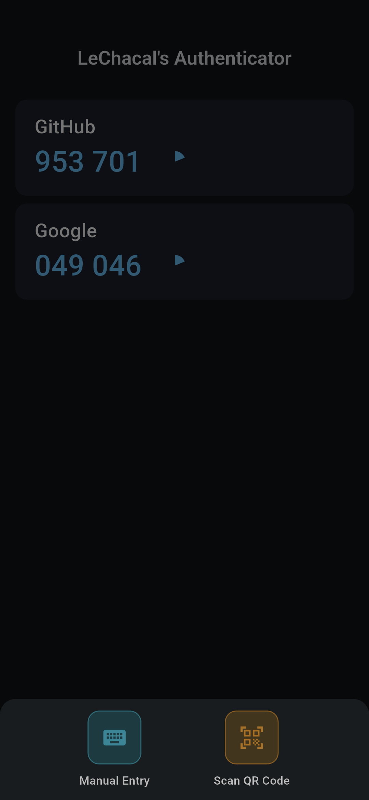
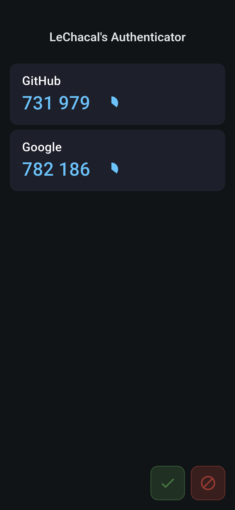
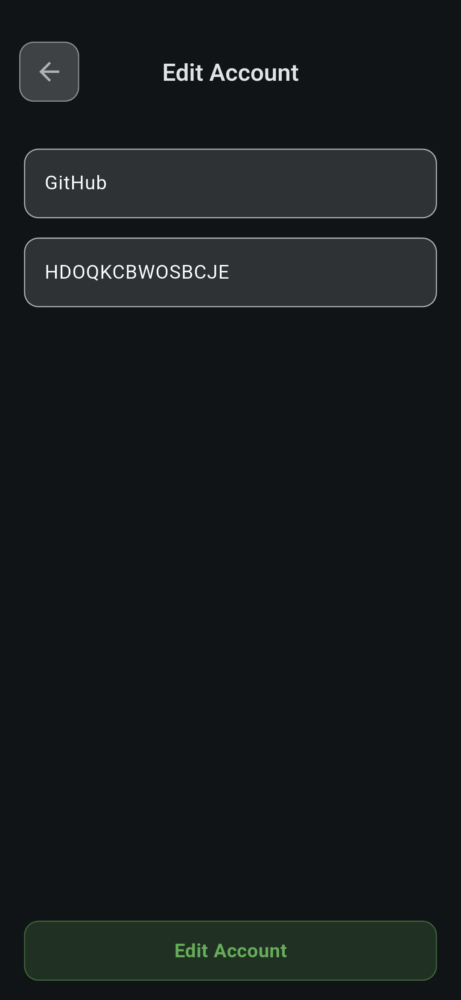
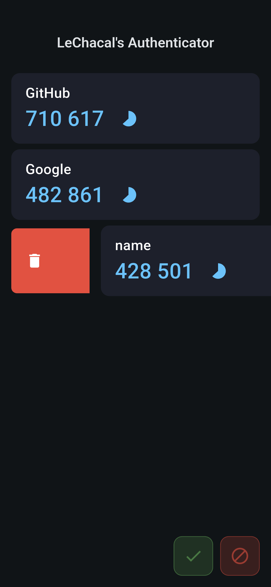
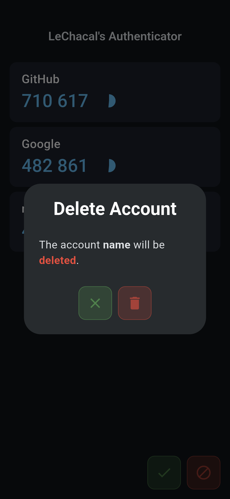

# 🔐 LeChacal's Authenticator

An Authenticator app like [Google Authenticator](https://play.google.com/store/apps/details?id=com.google.android.apps.authenticator2) but made by [me](https://github.com/Dev-LeChacal). \
You can do whatever you want with the code. \
Just mention me if you use it in a big project.

There is a widget that you can put on your home screen. \
Only work when app opened.

> Note: This project only use ai for big errors that I can't fix (just explain the error, zero code generated). Just remember I'm not a pro.

## 📸 Screenshots

Here some screenshots:

  

  
  
  

  
  
  
  

