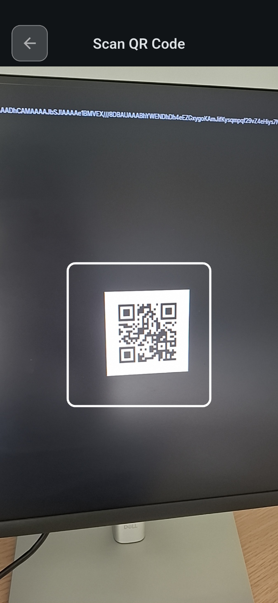
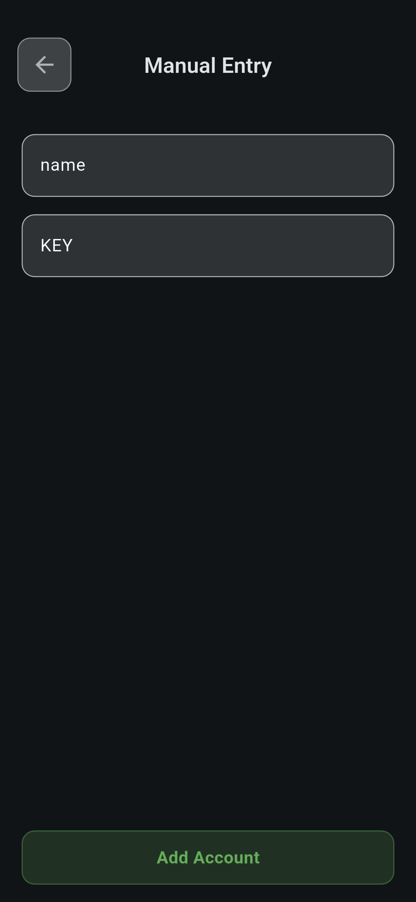

# 🔐 LeChacal's Authenticator

A secure, open-source two-factor authentication app built from scratch

[Features](#-features) • [Screenshots](#-screenshots) • [Installation](#-installation) • [Usage](#-usage) • [Security](#-security) • [Contributing](#-contributing)

## 📖 About

LeChacal's Authenticator is a custom-built two-factor authentication (2FA) application, similar to Google Authenticator, designed and developed entirely from scratch. This personal project implements Time-based One-Time Password (TOTP) authentication, providing a secure and transparent alternative to commercial authenticator apps.

### Why This Project?

- 🎓 **Educational Purpose**: Built to understand the internals of TOTP authentication
- 🔓 **Open Source**: Full transparency - see exactly how your codes are generated
- 🛠️ **Customizable**: Fork it and adapt it to your needs
- 🚀 **Modern Stack**: Built with Flutter for smooth cross-platform performance

## ✨ Features

- **🔢 TOTP Code Generation** - Generate time-based one-time passwords compatible with major services
- **🔒 Secure Local Storage** - All secrets stored locally on your device with encryption
- **⏱️ Real-Time Countdown** - Visual timer showing when codes refresh (every 30 seconds)
- **📱 Clean UI/UX** - Intuitive interface for easy account management
- **📷 QR Code Scanning** - Quick setup by scanning QR codes from services
- **🎯 Universal Compatibility** - Works with any service supporting TOTP (Google, GitHub, Discord, etc.)

## 📸 Screenshots

<p align="center">
  
  
  
  
</p>

## 🚀 Installation

### Prerequisites

Before you begin, ensure you have the following installed:

- [Flutter SDK](https://flutter.dev/docs/get-started/install) (3.0 or higher)
- [Dart SDK](https://dart.dev/get-dart) (included with Flutter)
- Android Studio / Xcode (for emulators)
- A physical device or emulator for testing

### Setup Instructions

1. **Clone the repository**
   ```bash
   git clone https://github.com/Dev-LeChacal/LeChacals-Authenticator.git
   ```

2. **Navigate to the project directory**
   ```bash
   cd LeChacals-Authenticator
   ```

3. **Install dependencies**
   ```bash
   flutter pub get
   ```

4. **Run the app**
   ```bash
   flutter run
   ```

### Building for Production

**Android:**
```bash
flutter build apk --release
```

**iOS:**
```bash
flutter build ios --release
```
> **Note**: To compile for ios you need a Mac and XCode installed.

## 📱 Usage

### Adding an Account

1. Tap the '+' button to add a new account
2. **Scan QR Code** or manually enter the secret key
3. Name your account (e.g., "Google: john@email.com")
4. Save - Your 6-digit code will appear instantly

### Managing Accounts

- **Copy Code**: Press to copy to clipboard
- **Delete Account**: Double-tap to delete
- **Reorganize Accounts**: Long-press to reorganize 

### How It Works

The app uses the TOTP algorithm (RFC 6238) which generates codes based on:
- A shared secret key (provided by the service)
- The current time

Codes refresh every 30 seconds automatically, providing rolling security for your accounts.

## 🔒 Security

This application handles sensitive authentication data. Please follow these security guidelines:

### Best Practices
- ✅ **Keep your device secure** - Use PIN/biometric lock
- ✅ **Never share your secret keys** - They're equivalent to passwords
- ✅ **Enable automatic backups** - Don't lose access to your accounts
- ✅ **Use strong device encryption** - Enable full disk encryption
- ⚠️ **Backup codes** - Always save backup codes from services
- ❌ **Don't screenshot codes** - They can be intercepted

### Security Features
- All secrets are stored locally on your device
- No data is sent to external servers
- Encryption at rest using platform-specific secure storage
- No analytics or tracking implemented

## 🛠️ Tech Stack

- **Framework**: Flutter 3.x
- **Language**: Dart
- **TOTP Implementation**: RFC 6238 compliant
- **Storage**: Secure platform-specific storage (Keychain on iOS, KeyStore on Android)

### Key Dependencies

```yaml
dependencies:
  otp                      # TOTP generation
  mobile_scanner           # QR scanning
  flutter_secure_storage   # Secure storage
  vibration                # Haptic Feedback
```

## 🗺️ Roadmap

Planned features for future releases:

- Biometric authentication lock
- Multiple account folders/categories
- Search functionality
- Widget support for quick access
- Custom icons for accounts

## 🤝 Contributing

Contributions, issues, and feature requests are welcome!

### How to Contribute

1. Fork the project
2. Create your feature branch (`git checkout -b feature/AmazingFeature`)
3. Commit your changes (`git commit -m 'Add some AmazingFeature'`)
4. Push to the branch (`git push origin feature/AmazingFeature`)
5. Open a Pull Request

### Contribution Guidelines

- Follow Flutter/Dart style guide
- Write meaningful commit messages
- Add tests for new features
- Update documentation as needed

## 📄 License

This project is licensed under the MIT License - see the [LICENSE](LICENSE) file for details.

This means you can:
- ✅ Use it commercially
- ✅ Modify it
- ✅ Distribute it
- ✅ Use it privately

With the only requirement to include the original license and copyright notice.

## 👤 Author

**LeChacal**
- GitHub: [@Dev-LeChacal](https://github.com/Dev-LeChacal)
- Project Link: [LeChacals-Authenticator](https://github.com/Dev-LeChacal/LeChacals-Authenticator)

## 🙏 Acknowledgments

- Inspired by Google Authenticator
- Thanks to the open-source community for TOTP libraries and resources
- RFC 6238 specification for TOTP algorithm
- Flutter community for excellent documentation and support

## 💬 Support

If you encounter any issues or have questions:

1. Check the [Issues](https://github.com/Dev-LeChacal/LeChacals-Authenticator/issues) page
2. Create a new issue if needed
3. Join discussions in the repository

## ⭐ Show Your Support

If you find this project useful, please consider:
- Giving it a ⭐ star on GitHub
- Sharing it with others
- Contributing to its development

---

<p align="center">
  Made with ❤️ by LeChacal
</p>

<p align="center">
  <sub>This is a personal project created for educational purposes</sub>
</p>